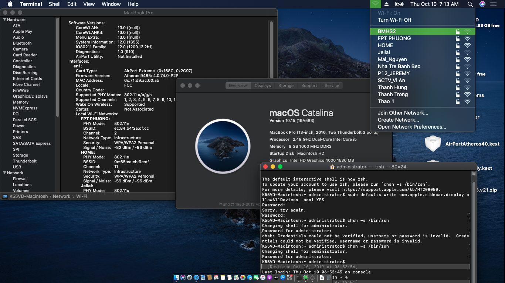
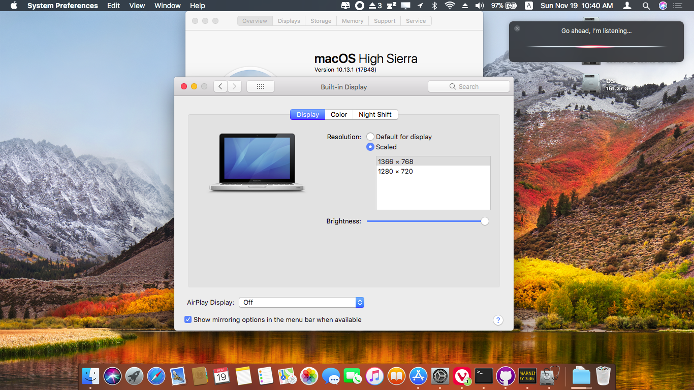

# End Support in July, 2020. Because Apple do not support the same model like my laptop. Let's move to Macbook Air or Macbook Pro, even Windows to get good support.

## How to install OS X Yosemite 10.10, OS X El Capital 10.11, macOS Sierra 10.12, macOS High Sierra 10.13, macOS Mojave 10.14, mac OS Catalina 10.15 on Laptop ASUS K55VD

Make Laptop ASUS K55VD like Mac Book Pro 2012 late run real macOS.
This is a working set of kexts and configurations for running OS X, macOS for laptop ASUS K55VD.

#

## DOWNLOAD: PLEASE CHECK MY RELEASES.

   macOS all versions https://bit.ly/AllVersionsFromOSX2macOS
   Update Full Function macOS Catalina
   https://github.com/southernvevo/ASUS-K55VD-HACKINTOSH/releases/

## Status
 - Current version: <b>up to 2021 with mac OS Catalina 10.15.7</b>
 - Bootloader: Clover EFI
 - Working: CPU steps, sleep, audio, multitouch, FN keys, USB, camera, wifi, bluetooth...
 - Not working: GPU (had been disabled)...

## How to install
 - Option 1: Follow the instructions in the video list above.

**How to install macOS Sierra 10.12 on Laptop ASUS K55VD**

    https://www.youtube.com/playlist?list=PLUq84GaSeHqn9vLo0XQlzfbxZF9s-cH9R

**How to install macOS High Sierra 10.13 on Laptop ASUS K55VD**

    https://www.youtube.com/playlist?list=PLUq84GaSeHqnUXcDzDq_qUARB0Z-nFt-B

But I have change some thing and added.

 - Option 2: Follow guide below:

<a href="/Lang/en.md">English</a>

<a href="/Lang/vi.md">Tiếng Việt</a>

## Keyboard Function:
 - Shift + F2: Brightness down
 - Shift + F3: Brightness up
 - Shift + F4: Hide/Show launchpad
 - Shift + F5: Show all windows of app
 - Shift + F6: Show windows present of app
 - Shift + F11: Close windows present of app
 - Shift + F12: Show/ Hide windows present
 - Fn + F5 : Brightness down
 - Fn + F6 : Brightness up
 - Fn + F7: Turn of display
 - Fn + F9: Turn on/off Touchpad
 - Fn + F10: Mute
 - Fn + F11: Volume down
 - Fn + F12: Volume up
 - Fn + arrow up: Stop media
 - Fn + arrow down: Pause/Play media
 - Fn + arrow left: play previous media
 - Fn + arrow right: play next media

## Thanks for sites and guys
- Acidanthera: https://github.com/acidanthera/
- Adam Strzelecki: https://github.com/nanoant/
- BetaDroid: https://github.com/BetaDroid/
- Bùi Minh Bình: https://niemtin007.blogspot.com/
- chunnann: https://github.com/chunnann/
- Clover EFI Bootloader Team: https://github.com/Clover-EFI-Bootloader/
- Facebook: https://www.facebook.com/southernvevo
- Github: https://github.com/
- Google: https://youtube.com/southernvevo/
- headkaze: https://github.com/headkaze/
- Ipang Dwi: https://github.com/ipang-dwi
- Macintosh-VN http://macintosh.vn/
- OSX.vn: http://osx.vn/
- RehabMan: https://github.com/RehabMan/
- syscl: https://github.com/syscl
- Tobias Salzmann: https://github.com/Eun/
- Tonymacx86.com http://tonymacx86.com/
- Weloveapple: https://weloveapple.vn/
- ZeRo Xu: https://github.com/xzhih/

## Thanks for visting and watching

## 10.15.7 mac OS Catalina Full and Recommend

## 10.14.6 mac OS Mojave Full

## 10.13.6 mac OS High Sierra Full

## 10.12.6 mac OS Sierra Full

