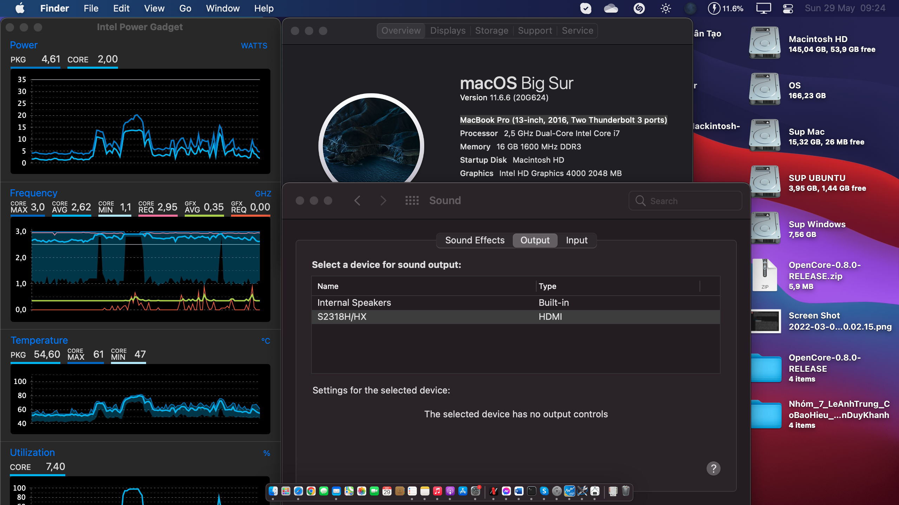

## How to install hackintosh from version OS X to Mac OS on Laptop ASUS K55VD.

Make Laptop ASUS K55VD like Mac Book Pro 2012 late run real macOS.
This is a working set of kexts and configurations for running OS X, macOS for laptop ASUS K55VD.

#

## DOWNLOAD ALL VERSIONS FROM OS X TO MAC OS.

 https://bit.ly/AllVersionsFromOSX2macOS  
 
or

 https://maclife.io/tong-hop-link-tai-cac-phien-ban-macos-big-sur-tu-server-apple.html
 
## DOWNLOAD AT MY RELEASES.

 https://github.com/southernvevo/ASUS-K55VD-HACKINTOSH/releases/

## Status
 - Current version: 
   + <b>up to 2021 with mac OS Monterey 12.4 with OpenCore (Graphics and WiFi will not work).</b>
   + <b>up to 2021 with mac OS Big Sur 11.7.10 with OpenCore.</b>
   + <b>up to 2021 with mac OS Catalina 10.15.7 with Clover.</b>
 - Bootloader: Clover | OpenCore 0.8.0
 - Working: CPU steps, sleep, audio, multitouch, FN keys, USB, camera, wifi, Bluetooth...
 - Not working: GPU (had been disabled)...
 - Note: The OpenCore source code is also work with mac OS Catalina 10.15.7.

## How to install
 - Option 1: Follow the instructions in the video list above.

**How to install macOS Sierra 10.12 on Laptop ASUS K55VD**

 https://www.youtube.com/playlist?list=PLUq84GaSeHqn9vLo0XQlzfbxZF9s-cH9R

**How to install macOS High Sierra 10.13 on Laptop ASUS K55VD**

 https://www.youtube.com/playlist?list=PLUq84GaSeHqnUXcDzDq_qUARB0Z-nFt-B

But I have changed something and added.

 - Option 2: Follow the guide below:

 <a href="/Lang/en.md">English</a>

 <a href="/Lang/vi.md">Tiếng Việt</a>

## Keyboard Function:
 - Fn + F5 or Screen Lock : Brightness down 
 - Fn + F6 or Pause Break: Brightness up
 - Fn + F7: Turn of display
 - Fn + F9: Turn on/off Touchpad
 - Fn + F10: Mute
 - Fn + F11: Volume down
 - Fn + F12: Volume up
 - Fn + arrow up: Stop media
 - Fn + arrow down: Pause/Play media
 - Fn + arrow left: play previous media
 - Fn + arrow right: play next media
 - Shift + F2 or Screen Lock (F14 in mac) for plug keyboard : Brightness down
 - Shift + F3 or Pause Break (F15 in mac) for plug keyboard: Brightness up
 - Shift + F4: Hide/Show launchpad
 - Shift + F5: Show all windows of app
 - Shift + F6: Show windows present of app
 - Shift + F11: Close windows present of app
 - Shift + F12: Show/ Hide windows present

## Thanks for sites and guys
- Apple: https://www.apple.com
- Acidanthera: https://github.com/acidanthera/
- Adam Strzelecki: https://github.com/nanoant/
- BetaDroid: https://github.com/BetaDroid/
- Bùi Minh Bình: https://niemtin007.blogspot.com/
- chunnann: https://github.com/chunnann/
- Clover EFI Bootloader Team: https://github.com/Clover-EFI-Bootloader/
- CloverHackyColor: https://github.com/CloverHackyColor
- Facebook: https://www.facebook.com/southernvevo
- Github: https://github.com/
- Google: https://youtube.com/southernvevo/
- headkaze: https://github.com/headkaze/
- Ipang Dwi: https://github.com/ipang-dwi
- Macintosh-VN http://macintosh.vn/
- OSX.vn: http://osx.vn/
- RehabMan: https://github.com/RehabMan/
- syscl: https://github.com/syscl
- Tobias Salzmann: https://github.com/Eun/
- Tonymacx86.com http://tonymacx86.com/
- Weloveapple: https://weloveapple.vn/
- ZeRo Xu: https://github.com/xzhih/
- Point View: https://www.youtube.com/channel/UC8E0M-dIEr44HHWfs8nv-Cg
- hieplpvip: https://github.com/hieplpvip
- EMlyDinEsH: https://osxlatitude.com/profile/7370-emlydinesh/
- Pico joe: https://www.insanelymac.com/forum/profile/1113740-pico-joe/
- Nguyễn Văn Vương: https://github.com/nguyentuevuong/
- Rafael M.: https://github.com/rafaelmaeuer/Asus-UX32VD-Hackintosh/

## Thanks for visiting and watching

## 11.6.6 mac OS Big Sur Full and Recommend version mac OS Big Sur 11.6.6

## 10.15.7 mac OS Catalina Full with Clover bootloader

## 10.14.6 mac OS Mojave Full with Clover bootloader

## 10.13.6 mac OS High Sierra Full with Clover bootloader

## 10.12.6 mac OS Sierra Full with Clover bootloader

